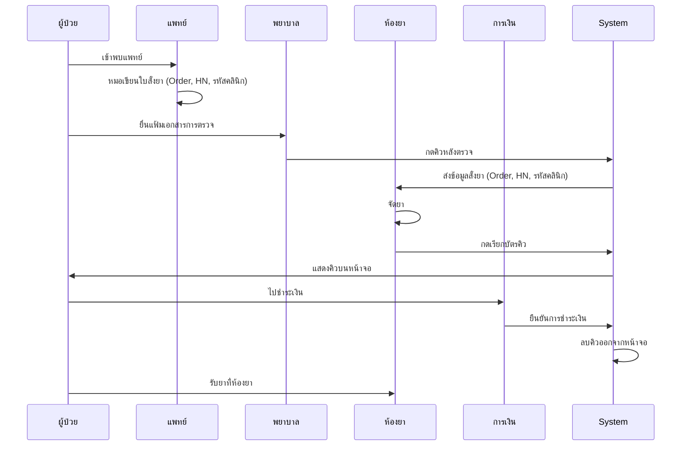

# Readme
## Create By : Sarawut
### Description : เป็นโปรแกรมช่วยในการทำงาน ของงานวิเคราะห์และพัฒนาโปรแกรม

```mermaid
sequenceDiagram
    participant P as ผู้ป่วย
    participant D as แพทย์
    participant N as พยาบาล
    participant PH as ห้องยา
    participant F as การเงิน

    P->>D: เข้าพบแพทย์
    D->>D: หมอเขียนใบสั่งยา (Order, HN, รหัสคลินิก)
    P->>N: ยื่นแฟ้มเอกสารการตรวจ
    N->>System: กดคิวหลังตรวจ
    System->>PH: ส่งข้อมูลสั่งยา (Order, HN, รหัสคลินิก)

    PH->>PH: จัดยา
    PH->>System: กดเรียกบัตรคิว
    System->>P: แสดงคิวบนหน้าจอ

    P->>F: ไปชำระเงิน
    F->>System: ยืนยันการชำระเงิน
    System->>System: ลบคิวออกจากหน้าจอ

    P->>PH: รับยาที่ห้องยา
```
